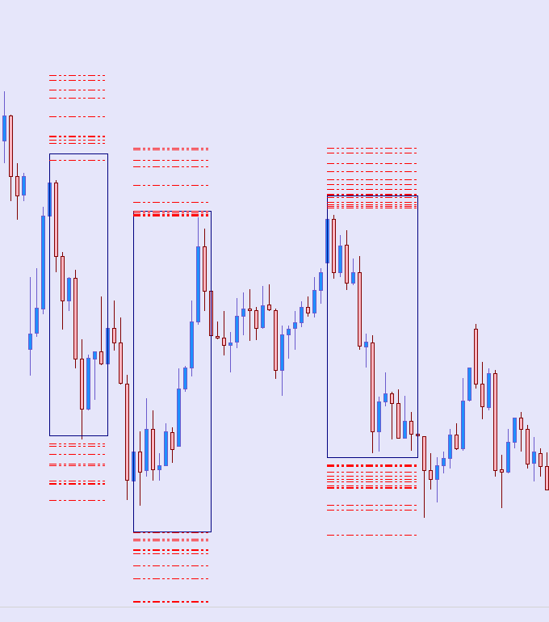

# simulate-liquidity

## Overview

This MetaTrader 4 indicator helps traders **simulate potential liquidity zones** on the chart by drawing **liquidity lines** based on price action within selected rectangles.

When a rectangle is drawn on the chart and clicked, the indicator:

* Analyzes candle data inside the rectangle,
* Computes price distances,
* Clusters the adjusted price levels,
* And draws liquidity lines (high and low) based on those clusters.

---

## How to Use

1. **Attach the indicator** to any chart.
2. **Draw a rectangle** on the chart covering the price zone you want to analyze.
3. **Click the rectangle** — the indicator will:

   * Calculate highs and lows inside the rectangle,
   * Cluster price distances into high and low zones,
   * And **draw liquidity lines** accordingly.
4. To clear the lines, either:

   * Delete the rectangle, or
   * Remove the indicator.

---
